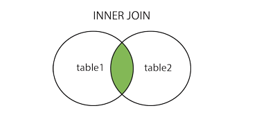
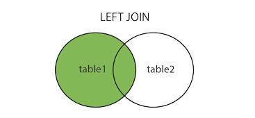
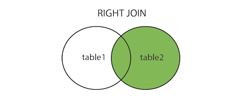
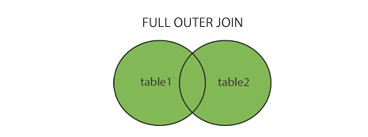

SQL concepts for data science

#### CASE WHEN

ref link: https://www.w3schools.com/sql


```python
SELECT OrderID, Quantity,
CASE WHEN Quantity > 30 THEN 'The quantity is greater than 30'
WHEN Quantity = 30 THEN 'The quantity is 30'
ELSE 'The quantity is under 30'
END AS QuantityText
FROM OrderDetails
LIMIT 5;
```


#### Left Joins vs Inner Joins


```python
#inner join
SELECT column_name(s)
FROM table1
INNER JOIN table2
ON table1.column_name = table2.column_name;
```



#### LEFT JOIN Syntax or LEFT OUTER JOIN


```python
SELECT column_name(s)
FROM table1
LEFT JOIN table2
ON table1.column_name = table2.column_name;
```



#### RIGHT JOIN Syntax or RIGHT OUTER JOIN


```python
SELECT column_name(s)
FROM table1
RIGHT JOIN table2
ON table1.column_name = table2.column_name;
```



#### FULL JOIN OR FULL OUTER JOIN


```python
SELECT column_name(s)
FROM table1
FULL OUTER JOIN table2
ON table1.column_name = table2.column_name
WHERE condition;
```



#### SQL HAVING Clause


```python
SELECT column_name(s)
FROM table_name
WHERE condition
GROUP BY column_name(s)
HAVING condition
ORDER BY column_name(s);
```

#### Sub query


```python
SELECT employee_id, first_name, last_name, salary
FROMemployees
WHERE salary > (SELECT AVG(salary)FROM
            employees);
```

#### Correlated sub query


```python
SELECT employee_id, first_name, last_name, salary, department_id
FROM employees e
WHERE salary > (SELECT AVG(salary)FROM
            employees WHERE
            department_id = e.department_id)
```
